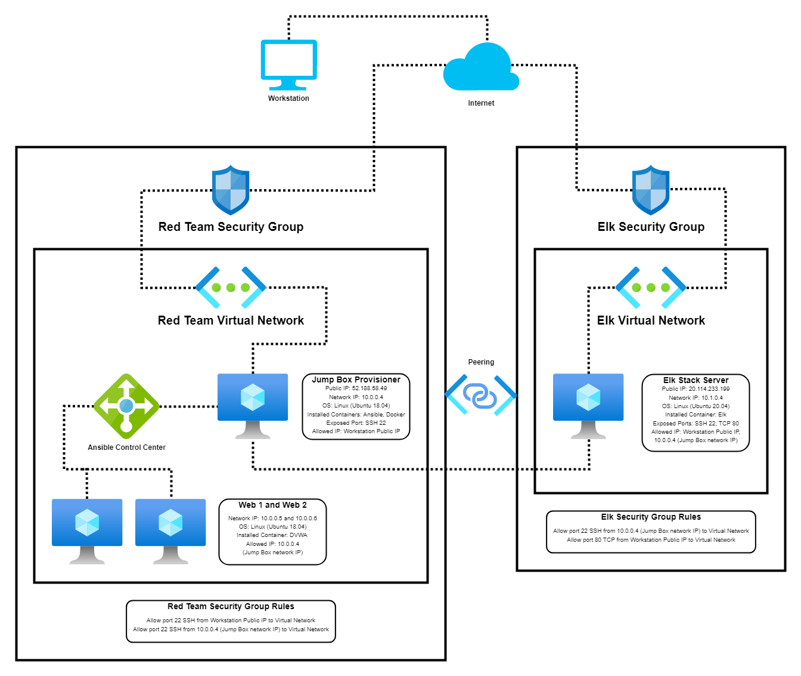
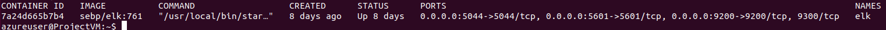

## Automated ELK Stack Deployment

The files in this repository were used to configure the network depicted below.

These files have been tested and used to generate a live ELK deployment on Azure. They can be used to either recreate the entire deployment pictured above. Alternatively, select portions of the yml file may be used to install only certain pieces of it, such as Filebeat.

  - _TODO: Enter the playbook file._

This document contains the following details:
- Description of the Topologu
- Access Policies
- ELK Configuration
  - Beats in Use
  - Machines Being Monitored
- How to Use the Ansible Build

### Description of the Topology

The main purpose of this network is to expose a load-balanced and monitored instance of DVWA, the D*mn Vulnerable Web Application.

Load balancing ensures that the application will be highly secure, in addition to restricting access to the network.
- Load balancers help prevent DDoS attacks to the server. Jump boxes are seperate security machines that are used to connect to other servers and untrusted environments.

Integrating an ELK server allows users to easily monitor the vulnerable VMs for changes to the data and system logs.
- FIlebeat watches log files and collects log events.
- Metricbeat collects stats and sends them to any output you want.

The configuration details of each machine may be found below.
_Note: Use the [Markdown Table Generator](http://www.tablesgenerator.com/markdown_tables) to add/remove values from the table_.

| Name       | Function     | IP Address | Operating System |
|------------|--------------|------------|------------------|
| Jump Box   | Gateway      | 10.0.0.1   | Linux            |
| Elk        | Elk Server   | 10.1.0.4   | Linux            |
| Web 1      | Web Server   | 10.0.0.5   | Linux            |
| Web 2      | Web Server   | 10.0.0.6   | Linux            |

### Access Policies

The machines on the internal network are not exposed to the public Internet. 

Only the Jump Box machine can accept connections from the Internet. Access to this machine is only allowed from the following IP addresses:
- Workstation's public IP address

Machines within the network can only be accessed by the Jump Box gateway and the Workstation's public IP address.
- Workstation's public IP address
- Jump Box gateway IP: 10.0.0.4

A summary of the access policies in place can be found in the table below.

| Name     | Publicly Accessible | Allowed IP Addresses                     |
|----------|---------------------|------------------------------------------|
| Jump Box | No                  | Workstation's public IP address          |
| Elk      | No                  | Workstation's public IP address, 10.0.0.4|
| Web 1    | No                  | 10.0.0.4                                 |
| Web 2    | No                  | 10.0.0.4                                 |

### Elk Configuration

Ansible was used to automate configuration of the ELK machine. No configuration was performed manually, which is advantageous because...
- It allows for quick and easy setup for any system. All you have to do is list the process through tasks, and Ansible will work through them.

The playbook implements the following tasks:
- First, we configure the VM by setting the host and remote user to Elk and azureuser respectively.
- Next, we install docker, pip3, and the Docker Python module to allow docker to use python 3 in the setup. We will also be expanding the memory that the container is allowed to use. This is required for the container to function as intended.
- Lastly, we download the docker container and set it to start on boot with the published ports 5601:5601, 9200:9200, and 5044:5044.

The following screenshot displays the result of running `docker ps` after successfully configuring the ELK instance.

### Target Machines & Beats
This ELK server is configured to monitor the following machines:
- Web 1: 10.0.0.5
- Web 2: 10.0.0.6

We have installed the following Beats on these machines:
- Jump Box, Web 1, and Web 2 have both Filebeat and Metricbeat installed

These Beats allow us to collect the following information from each machine:
- FIlebeat will collect log events from the Web machines, and Metricbeat will collect metrics and stats. Both will ship the data straight to Elasticsearch.

### Using the Playbook
In order to use the playbook, you will need to have an Ansible control node already configured. Assuming you have such a control node provisioned: 

SSH into the control node and follow the steps below:
- Copy the playbook config file to the Web machines.
- Update the playbook config file to include the Filebeat and Metricbeat installers.
- Run the playbook, and navigate to "Check Data" on the Elk GUI to check that the installation worked as expected.

- Both the filebeat-config.yml and the metricbeat-config.yml are the playbook files needed. You must copy them to /etc/filebeat and /etc/metricbeat respectively
- To make Ansible run the playbook on a specific machine, you would update the Ansible hosts file. To specify the machine to install Elk vs Filebeat, you would update the install_elk.yml file.
- To check that the Elk server is running, navigate to http://(Elk External IP):5601/app/kibana